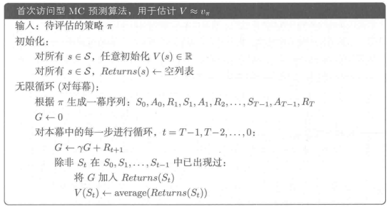
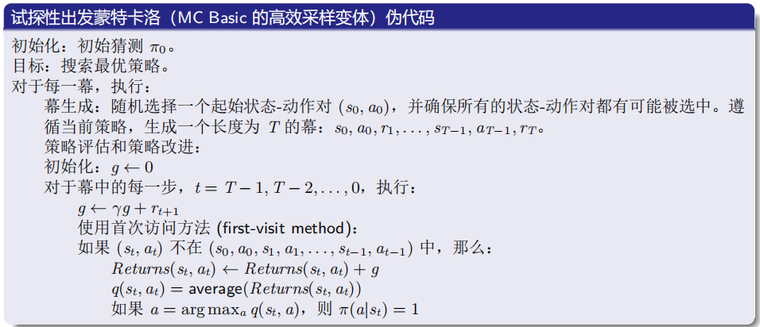
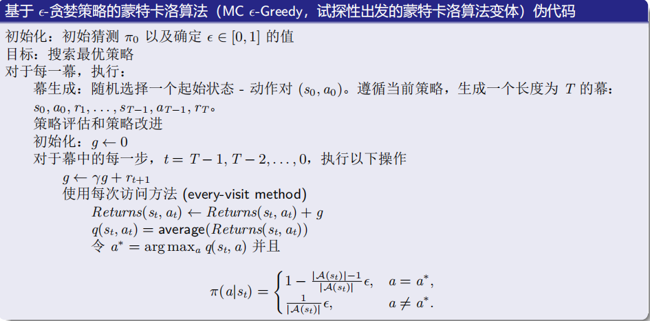
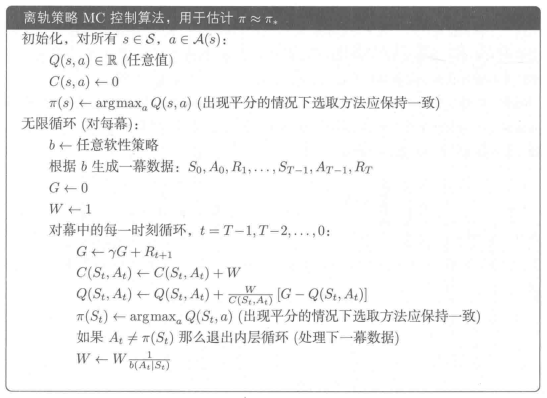
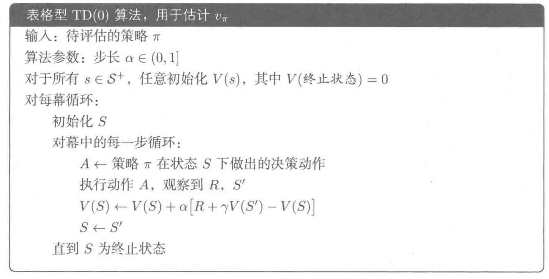

## 
《强化学习导论》第五章与第六章前三节读书报告
##### 
 智能科学与技术 2213530 张禹豪
# 强化学习读书笔记 - 蒙特卡洛方法

## 目录
1. [蒙特卡洛方法概述](#蒙特卡洛方法概述)
2. [蒙特卡洛预测](#蒙特卡洛预测)
3. [蒙特卡洛算法](#蒙特卡洛算法)
4. [动作价值的蒙特卡洛估计](#动作价值的蒙特卡洛估计)
5. [蒙特卡洛控制](#蒙特卡洛控制)
6. [没有试探性出发假设的蒙特卡洛控制](#没有试探性出发假设的蒙特卡洛控制)

---

## 蒙特卡洛方法概述
- **核心思想**：通过采样经验（真实或模拟）的平均回报来估计价值函数，适用于分幕式任务。
- **与动态规划（DP）的区别**：
  - 无需环境动态的完整知识，仅需采样经验。
  - 逐幕更新而非在线更新。
  - 状态估计独立，无自举（bootstrapping）。
- **优势**：
  - 可从实际或模拟经验中学习。
  - 适合仅需部分状态价值估计的场景。

---

## 蒙特卡洛预测
### 算法分类
1. **首次访问型MC**：仅使用每幕首次访问状态的回报进行平均。
2. **每次访问型MC**：使用所有访问状态的回报进行平均。

### 算法伪代码（首次访问型）

---

## 蒙特卡洛算法
&emsp;&emsp;蒙特卡洛算法是一种基于经验的学习算法，它通过对环境进行多次随机采样，来估计状态值函数或动作值函数。蒙特卡洛算法的主要特点是不需要环境的模型，只需要与环境进行交互即可。
#### 基本的蒙特卡洛算法描述
给定一个初始策略$\pi_0$，在第$k$次迭代中有以下两个步骤：
- 步骤1：**策略评估**。此步骤是为了得到所有状态-动作对$(s,a)$对应的$q_{\pi_k}(s,a)$。具体来说，对于每个状态-动作对$(s,a)$，运行无限多个（或足够多）幕。这些幕回报的平均值用于近似$q_{\pi_k}(s,a)$。
- 步骤2：**策略改进**。此步骤是为了对所有$s\in S$求解$\pi_{k+1}(s)=argmax_\pi\sum_a\pi(a|s)q_{\pi_k}(s,a)$。贪婪最优策略是$\pi_{k+1}(a^*_k|s)=1$，其中$a^*_k=argmax_aq_{\pi_k}(s,a)$。
与策略迭代算法完全相同，除了
- 直接估计$q_{\pi_k}(s,a)$，而不是求解$v_{\pi_k}(s)$。
#### 基本的蒙特卡洛算法伪代码

---

## 动作价值的蒙特卡洛估计
### 核心问题
- 估计动作价值函数 $q(s,a)$（状态-动作对的价值）
- **试探性出发假设**：确保所有状态-动作对能被访问到
  - 方法1：指定状态-动作对作为起点
  - 方法2：使用随机策略（所有动作概率非零）
### 挑战
- 确定性策略导致某些动作无法被评估
- 需通过持续试探保证覆盖所有可能动作

---

## 蒙特卡洛控制
### 核心问题
- 估计最优策略 $\pi^*$
- **贪婪策略**：$\pi(a|s)=1$，其中 $a=argmax_aq(s,a)$
- **$\epsilon$-贪婪策略**：以 $1-\epsilon$ 的概率选择最优动作，以 $\epsilon$ 的概率选择随机动作
- **探索-利用权衡**：平衡探索（发现新策略）与利用（利用已知策略）的权衡

### 广义策略迭代（GPI）
- **策略评估**：估计当前策略的价值函数
- **策略改进**：更新策略为贪婪策略：贪心选择动作$π(s) = argmax_a q(s,a)$
- **策略迭代**：重复策略评估和策略改进直至收敛
- 交替进行策略评估与策略改进：
$$π_0 → E评估 → q_{π0} → I改进 → π_1 → E评估 → ...$$
###  更高效地利用数据
- 基本蒙特卡洛算法：
  - 优点：清晰地揭示核心思想！
  - 缺点：过于简单，在实际中不太实用。
- **试探性出发蒙特卡洛算法**：如果我们更高效地使用数据并更新估计值，就会得到一种新的算法，称为试探性出发蒙特卡洛（MC Exploring Starts）算法：

> - 什么是试探性出发?
>   - 试探性出发意味着我们需要生成足够多的从每个状态-动作对开始的幕。
>   - 基本蒙特卡洛算法和试探性出发蒙特卡洛算法都需要这个假设。
> - 为何要考虑试探性出发？
>   - 从理论角度，只有当每个状态对应的每个动作值都被充分探索时，我们才能正确地选择最优动作。
>   - 相反，如果某个动作未被探索，这个动作有可能恰好是最优动作，进而被错过。
在实际应用中，试探性出发很难实现。对于许多应用，尤其是那些涉及与环境进行物理交互的应用，很难收集到从每个状态-动作对开始的幕。

---

## 没有试探性出发假设的蒙特卡洛控制
&emsp;&emsp;如何避免很难被满足的试探性出发假设？唯一的一般性解决方案是智能体能够持续不断地选择所有可能的动作。有两种方法可以保证这一点，分别被称为同轨策略$(on-policy)$方法和离轨策略$(off-policy)$方法。
### 柔性策略
如果采取任何动作的概率都是正的，那么该策略被称为柔性策略。为什么要引入柔性策略呢？
- 使用柔性策略时，只要几个足够长的幕就可以足够多地访问到每个状态-动作对。
- 这样一来，我们就不需要大量的从每个状态-动作对开始的幕。因此，试探性出发的要求就可以被
去除。
### ϵ-贪婪策略
我们将使用什么柔性策略？答案是：ϵ-贪婪策略。
- 什么是 ϵ-贪婪策略？$$\pi(a|s)=\begin{cases}1-\frac{ϵ}{|A(s)|}(|A(s)|-1)，对于贪婪动作 \\\frac{ϵ}{|A(s)|}，对于其他|A(s)|-1个动作\end{cases}$$
其中，$ϵ ∈ [0, 1]，|A(s)|$ 是状态$ s $下的动作数量。
- 选择贪婪动作的概率总是大于其他动作，因为贪婪动作的概率是 $1-\frac{ϵ}{|A(s)|}(|A(s)|-1)=1-ϵ+\frac{ϵ}{|A(s)|}\geq \frac{ϵ}{|A(s)|}$。
- 为什么使用 ϵ-贪婪策略？为了在**利用和探索**之间取得平衡。
- 当 $ϵ=0$ 时，策略是完全贪婪的，这意味着智能体只会选择已知的最优动作。探索较少但利用较多。
- 当 $ϵ=1$ 时，策略是完全随机的，这意味着智能体会随机选择动作。探索较多但利用较少。
### 同轨策略的蒙特卡洛控制
#### 核心思想
- **ε-贪心策略**：以概率 `1-ε` 选择最优动作，以 `ε/|A(s)|` 概率随机选择其他动作。
- **策略改进定理**：通过数学证明，ε-贪心策略的每一步改进都能提升策略性能。
- $On-policy$是指在策略评估和策略改进时使用相同的策略。在$On-policy$中，我们使用$\epsilon-greedy$策略来进行策略评估和策略改进。
- 算法类型：基于策略的蒙特卡洛方法(On-policy Monte Carlo)

#### 算法步骤：
  - 1.**策略生成**：使用当前策略（如ε−greedy）与环境交互，生成完整轨迹。
  - 2.**值函数估计**：对每个状态-动作对记录首次访问的累积回报，计算平均值作为Q值估计。更新公式为：$$Q(s,a)=Q(s,a)+\alpha[G_t-Q(s,a)]$$
  - 3.**策略改进**：根据当前Q值，贪婪地更新策略，逐步减少ε以减少探索性。
#### 特点：
  - 策略和采样策略是同一个（即目标策略 = 采样策略）。
  - 适用于策略改进和评估的循环过程。
  - 通过epsilon动态调整探索程度
#### 算法流程

### 离轨策略与重要性采样
#### 核心思想
- **覆盖假设**：目标策略 π 的所有动作必须在行动策略 b 中有非零概率。
- **重要度采样比**：调整回报权重，将行动策略数据转换为目标策略期望。
#### 重要度采样类型
##### 1. 普通重要度采样
- **目标**：估计目标策略的价值函数。
- **公式**：$$q_{\pi}(s,a)=\frac{\sum_{t\in T(s,a)}\rho_{t:T}G_t}{|T(s,a)|}$$
- **特点**：无偏，但方差可能无限大（因重要度采样比的无界性）。
##### 2. 加权重要度采样
- **目标**：估计行动策略的价值函数。
- **公式**：$$q_{b}(s,a)=\frac{\sum_{t\in T(s,a)}\rho_{t:T}G_t}{\sum_{t\in T(s,a)}\rho_{t:T}}$$
- **特点**：有偏，但方差有界。
#### 数学推导
- **重要度采样比**：$$\rho_{t:T}=\prod_{k=t}^{T-1}\frac{\pi(A_k|S_k)}{b(A_k|S_k)}$$
### 增量式实现
#### 普通重要度采样
- 直接对回报加权平均，类似第2章的增量更新：
$$Q(s,a)\lArr Q(s,a)+\alpha(G_t-Q(s,a))$$
#### 加权重要度采样
- 维护权重累加和 C(s,a)，增量更新：$$Q(s,a)\lArr Q(s,a)+\frac{W}{C(s,a)}(G_t-Q(s,a))$$ $$Q(s,a)\lArr Q(s,a)+W$$(其中$W$为当前幕的重要度采样比)
### 离轨策略的蒙特卡洛控制
&emsp;&emsp;$Off-policy$是指在策略评估和策略改进时使用不同的策略。在$Off-policy$中，我们使用$\epsilon-greedy$策略来进行策略评估，使用贪婪策略来进行策略改进。
- 算法类型：基于采样策略的蒙特卡洛方法（Off-Policy MC）。
#### 算法步骤：
  - 1.**数据生成**：使用行为策略（如随机策略）生成轨迹数据。
  - 2.**重要性采样**：通过重要性采样率$W_t=\prod^{t-1}_{k=0}\frac{\pi(\alpha_k|s_k)}{b(\alpha_k|s_k)}$调整回报，将行为策略数据转换为对目标策略（如贪婪策略）的估计。更新公式为：$$Q(s,a)=Q(s,a)+\alpha W_t[G_t-Q(s,a)]$$
  - 3.**值函数更新**：基于调整后的回报，更新Q值，逐步优化。
#### 特点：
  - 允许目标策略和采样策略不同，适用于离线数据或复杂策略.
  - 需要计算重要性采样权重（W），增加了计算复杂度。
#### 算法实现：

# 强化学习读书笔记 - 时序差分学习（TD Learning）

## 目录
- [TD预测](#td预测)
- [TD与蒙特卡洛、动态规划的对比](#td与蒙特卡洛动态规划的对比)
- [TD误差与更新机制](#td误差与更新机制)
- [关键示例解析](#关键示例解析)
- [批量更新的最优性](#批量更新的最优性)
- [TD方法的优势总结](#td方法的优势总结)

---

## TD预测
### 核心思想
- **结合蒙特卡洛与动态规划**：  
  - 直接从经验中学习（无需环境模型），类似蒙特卡洛。  
  - 使用“自举法”（基于后续状态估计值更新当前状态），类似动态规划。  
- **单步更新**：在时刻 \( t+1 \) 即可更新 \( V(S_t) \)，无需等待幕结束。

### TD(0) 算法
**输入**：待评估策略 \(\pi\)，步长参数 \(\alpha \in (0,1]\)  
**初始化**：对所有状态 \( s \in S \)，初始化 \( V(s) \)（终止状态 \( V=0 \)）  
**流程**：  

### 数学公式
- TD更新目标：$$R_{t+1}+γV(S_{t+1})$$
- TD误差：$$δ_t=R_{t+1}+γV(S_{t+1})-V(S_t)$$
- 蒙特卡洛误差与TD误差的关系：$$G_t-V(S_t)=\sum^{T-1}_{k=t}\gamma^{k-t}δ_k（当V在幕中不变时）$$

---

## TD与蒙特卡洛、动态规划的对比
|特性|蒙特卡洛 (MC)|时序差分 (TD)|动态规划 (DP)|
|---|---|---|---|
|更新时机|幕结束后|单步后即时更新|需要完整环境模型|
|自举|否|是|是|
|方差|高（依赖完整回报）|低（仅依赖单步收益和估计）|无（依赖模型精确性）|
|在线学习|否|是|是（需模型）|
|适用场景|分幕式任务|分幕式/持续性任务|小规模状态空间|

---

## TD误差与更新机制
### 核心概念
- **采样更新 vs 期望更新**：
  - TD和MC使用采样更新（基于单次转移样本）。
  - DP使用期望更新（基于所有可能转移的期望）。
- **偏差-方差权衡**：
  - TD：低方差（单步收益），但有偏差（依赖估计值）。
  - MC：无偏差（真实回报），但高方差（依赖完整序列）。

---

## 批量更新的最优性
### 批量TD vs 批量MC
- 批量TD(0)：
  - 收敛到确定性等价估计（符合马尔可夫模型的最大似然解）。
  - 计算高效（内存复杂度$O(n)$ 逼近真实值）。
- 批量MC：
  - 收敛到**训练集最小均方误差解**。
  - 在非马尔可夫场景中可能更优，但无法推广到未来数据。

---

## TD方法的优势总结
- **优势**：
  - **在线学习**：单步更新，无需等待幕结束。
  - **低方差**：单步收益，无需完整序列。
  - **无模型**：无需环境模型，直接从经验学习。
  - **高效计算**：批量更新收敛到最优解。