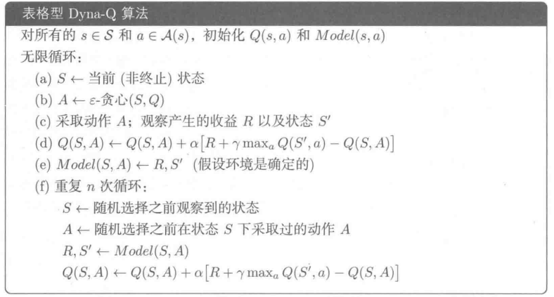
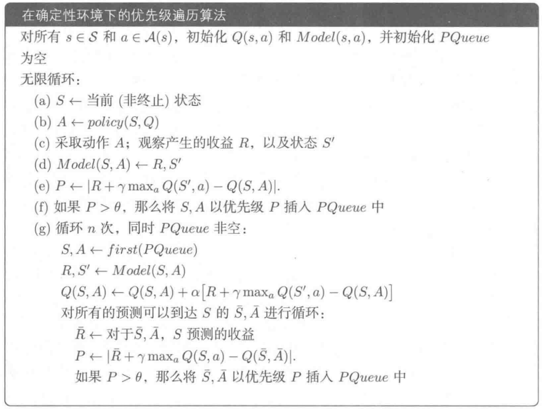

## 
《强化学习》第七章与第八章读书笔记
##### 
 智能科学与技术 2213530 张禹豪
## 第七章 n步自举法 / 时序差分学习
### 7.1 状态值的时间差分学习
#### 算法简介
该算法所需的数据/经验：
- $(s_0,r_1,s_1,...,s_t,r_{t+1},...)$，按照给定的策略$\pi$生成。

时序差分(TD)学习算法为：$$\begin{align}&v_{t+1}(s_t)=v_t(s_t)-\alpha_t(s_t)[v_t(s_t)-[r_{t+1}+\gamma v_t(s_{t+1})]]\\ &v_{t+1}(s)=v_t(s)\end{align}$$
其中 t = 0, 1, 2, . . .。这里，$v_t(s_t)$ 是 $v_π(s_t) $的估计状态值；$α_t(s_t)$ 是在时刻 $t $状态 $s_t $的学习率。
- 在时刻 $t$，仅更新访问过的状态$ s_t $的价值，而未访问的状态 $s = s_t $的价值保持不变。
- 当上下文明确时，(2) 中的更新将被省略

时序差分算法可以标注如下：
$$\begin{align}
\underbrace{v_{t+1}(s_t)}_{\text{new estimate}} = \underbrace{v_t(s_t)}_{\text{current estimate}} - \alpha_t(s_t)\underbrace{\left[v_t(s_t) - \underbrace{\left[r_{t+1} + \gamma v_t(s_{t+1})\right]}_{\substack{\text{TD target } \bar{v}_t}}\right]}_{\text{TD error } \delta_t}\end{align}
$$
- TD目标 $\bar{v}_t$ 是对 $v_π(s_t)$ 的估计。
$$\bar{v}_t \doteq r_{t+1} + \gamma v(s_{t+1})$$
- TD误差 $\delta_t$ 是对 $v_π(s_t)$ 的估计的偏差。
$$\delta_t \doteq v(s_t) - [r_{t+1} + \gamma v(s_{t+1})] = v(s_t) - \bar{v}_t$$

很明显，新的估计值 $v_{t+1}(s_t)$ 是当前估计值 $v_t(s_t)$ 和 TD 误差的组合。
#### 算法特性
**首先，为什么$\bar{v}_t$被称为TD目标呢？**
那是因为该算法会驱动$v(s_t)$朝着TD目标$\bar{v}_t$的方向改变。
证明如下：
> $$
\begin{aligned}
v_{t+1}(s_t) &= v_t(s_t) - \alpha_t(s_t)[v_t(s_t) - \overline{v}_t] \\
&\Rightarrow v_{t+1}(s_t) - \overline{v}_t = v_t(s_t) - \overline{v}_t - \alpha_t(s_t)[v_t(s_t) - \overline{v}_t] \\
&\Rightarrow v_{t+1}(s_t) - \overline{v}_t = [1 - \alpha_t(s_t)][v_t(s_t) - \overline{v}_t] \\
&\Rightarrow |v_{t+1}(s_t) - \overline{v}_t| = |1 - \alpha_t(s_t)||v_t(s_t) - \overline{v}_t|
\end{aligned}
$$由于 $\alpha_t(s_t)$ 是一个较小的正数，所以我们有
$$0 < 1 - \alpha_t(s_t) < 1$$因此，
$$|v_{t+1}(s_t) - \overline{v}_t| \leq |v_t(s_t) - \overline{v}_t|
$$这意味着 $v(s_t)$ 正朝着 $\overline{v}_t$ 的方向改变！

**其次，TD误差的解释是什么呢？**
$$\delta_t = v(s_t) - [r_{t+1} + \gamma v(s_{t+1})]$$

- 它是两个连续**时间**步之间的差值。
- 它反映了 $v_t$ 和 $v_\pi$ 之间的**差异**。为了理解这一点，记
    $$\delta_{\pi,t} \doteq v_\pi(s_t) - [r_{t+1} + \gamma v_\pi(s_{t+1})]$$注意到
$$\mathbb{E}[\delta_{\pi,t} | S_t = s_t] = v_\pi(s_t) - \mathbb{E}[R_{t+1} + \gamma v_\pi(S_{t+1}) | S_t = s_t] = 0$$
- **如果 $v_t = v_\pi$，那么 $\delta_t$ 在期望意义下应该为零。**
- 因此，如果 $\delta_t$ 不为零，那么 $v_t$ 不等于 $v_\pi$。
- TD误差可以被解释为**新息（innovation）**，这意味着从经验 $(s_t, r_{t+1}, s_{t+1})$ 中获得的新信息。
  
**其它特性：**
- 公式(3)中TD算法**仅估计给定策略的状态值**。
    - 它不估计动作值。
    - 它不搜索最优策略。
- 稍后，我们将了解如何估计动作值，然后搜索最优策略。
- 尽管如此，公式(3)中的时序差分算法对于理解核心思想至关重要。
#### 算法收敛性
> **定理（时序差分学习的收敛性）**
通过时序差分算法(1)，当 $ t \rightarrow \infty $，对于所有 $ s \in S $，若 $ \sum_t \alpha_t(s) = \infty $ 且 $ \sum_t \alpha_t^2(s) < \infty $，则 $ v_t(s) $ 以概率1收敛到 $ v_\pi(s) $。
注意：
- 这个定理表明，对于给定的策略 $ \pi $，可以通过时序差分算法找到状态值。
- 对于所有 $ s \in S $，$ \sum_t \alpha_t(s) = \infty $ 且 $ \sum_t \alpha_t^2(s) < \infty $ 必须成立。在时间步 $ t $，如果 $ s = s_t $ （意味着状态 $ s $ 在时刻 $ t $ 被访问），那么 $ \alpha_t(s) > 0 $；否则，对于所有其他 $ s \neq s_t $，$ \alpha_t(s) = 0 $。这要求每个状态必须被访问无穷多次（或足够多次）。
- 学习率 $ \alpha $ 通常被选为一个小常数。在这种情况下，$ \sum_t \alpha_t^2(s) < \infty $ 这个条件不再成立。当 $ \alpha $ 为常数时，仍然可以证明算法在期望意义下收敛。
#### 相比于蒙特卡洛方法的优缺点
虽然时序差分（TD）学习和蒙特卡罗（MC）学习都是无模型的，那么相较于蒙特卡罗学习，时序差分学习的优缺点是什么呢？
| TD/Sarsa学习                          | MC学习                              |
|---------------------------------------|-------------------------------------|
| **在线性**：TD学习是在线的。它在收到奖励后可以立即更新状态/动作值。 | **离线性**：MC学习是离线的。它必须等待一个片段完全收集完成。 |
| **持续性任务**：由于TD学习是在线的，它可以处理分幕式任务和连续性任务。 | **分幕式任务**：由于MC学习是离线的，它只能处理有终止状态的分幕式任务。 |
| **自举特性**：TD具有自举特性，因为值的更新依赖于该值之前的估计。因此，它需要初始猜测值。 | **非自举特性**：MC不具有自举特性，因为它可以在没有任何初始猜测的情况下直接估计状态/动作值。 |
| **估计方差低**：TD的估计方差比MC低，因为涉及的随机变量较少。例如，Sarsa只需要 \( R_{t+1} \)、\( S_{t+1}\)、\( A_{t+1} \)。| **估计方差高**：为估计 \( q_{\pi}(s_t, a_t) \)，我们需要\( R_{t+1} + \gamma R_{t+2} + \gamma^2 R_{t+3} + \ldots \) 的样本。假设每个片段的长度为\( L \)，则有$A^L$种可能的片段。|

*表: TD学习与MC学习的比较。*

---

### 7.2 动作值的时间差分学习 - Sarsa算法
- 上一节介绍的时序差分（TD）算法只能估计状态值。
- 接下来，我们引入Sarsa算法，这是一种可以直接估计动作值的算法。
- 我们还将了解如何使用Sarsa算法找到最优策略。

首先，我们的目标是估计给定策略 \(\pi\) 的动作值。
假设我们有一些经验 \(\{(s_t, a_t, r_{t+1}, s_{t+1}, a_{t+1})\}_t\)，Sarsa算法更新公式为：
\[
q_{t+1}(s_t, a_t) = q_t(s_t, a_t) - \alpha_t(s_t, a_t) \left[q_t(s_t, a_t) - [r_{t+1} + \gamma q_t(s_{t+1}, a_{t+1})]\right]
\]

\[
q_{t+1}(s, a) = q_t(s, a), \quad \forall (s, a) \neq (s_t, a_t)
\]其中t = 0，1，2，...。
- \( q_t(s_t, a_t) \) 是 \( q_\pi(s_t, a_t) \) 的估计值
- \( \alpha_t(s_t, a_t) \) 是依赖于$s_t$和$\alpha_t$的学习率

#### 为什么这个算法被称为Sarsa？
Sarsa是**State-Action-Reward-State-Action**的缩写，因为每一步更新都涉及这五个元素：\((s_t, a_t, r_{t+1}, s_{t+1}, a_{t+1})\)。
#### 与TD学习的关系
Sarsa是时序差分（TD）学习的动作值版本：
- 将TD中的状态值估计 \( v(s) \) 替换为动作值估计 \( q(s,a) \)
- 从数学角度，Sarsa算法的表达式表明它是一种随机近似算法，用于求解一下方程：
  \[
  q_{\pi}(s, a) = \mathbb{E}[R + \gamma q_{\pi}(S', A')|s, a], \quad \forall s, a
  \]这是用动作值表示的贝尔曼方程的另一种形式。
#### 收敛性
> **定理（Sarsa学习的收敛性）**
通过Sarsa算法，当 $ t \rightarrow \infty $，对于所有的 $(s, a)$，若 $\sum_t \alpha_t(s, a) = \infty$ 且 $\sum_t \alpha_t^2(s, a) < \infty$，则 $q_t(s, a)$ 以概率1收敛到动作值 $q_\pi(s, a)$。

注意：
- 这个定理表明，**对于给定的策略 $\pi$**，可以通过Sarsa算法找到动作值。
#### Sarsa算法的实现
强化学习的最终目标是找到最优策略。为此，我们可以将Sarsa算法与策略改进步骤相结合。这种组合算法也称为Sarsa算法。

> **伪代码：用Sarsa算法进行策略搜索**
> 对于每个幕，执行以下操作：
> - 如果当前状态 $ s_t $ 不是目标状态（终端状态），执行以下操作：
>  - 收集经验 $ (s_t, a_t, r_{t+1}, s_{t+1}, a_{t+1}) $：具体来说，根据 $ \pi_t(s_t) $ 执行动作 $ a_t $，生成 $ r_{t+1} $、$ s_{t+1} $，然后根据 $ \pi_t(s_{t+1}) $ 执行动作 $ a_{t+1} $。
>  - 更新Q值：
    $$
    q_{t+1}(s_t, a_t) = q_t(s_t, a_t) + \alpha_t(s_t, a_t) [r_{t+1} + \gamma q_t(s_{t+1}, a_{t+1}) - q_t(s_t, a_t)]
    $$
>  - 更新策略：
    $$
    \pi_{t+1}(a | s_t) =
    \begin{cases}
      1 - \frac{\epsilon}{|A|}(|A| - 1) & \text{如果 } a = \arg\max_a q_{t+1}(s_t, a) \\
      \frac{\epsilon}{|A|} & \text{否则}
    \end{cases}
    $$

**关于此算法：**
- 在$q(s_t, a_t)$更新后，状态$s_t$的策略会立即更新。这基于广义策略迭代（generalized policy
iteration）的思想。
- 该策略采用ϵ-贪婪策略而非贪婪策略，以便更好地平衡利用与探索。

**核心思想：**
- 核心思想很简单：即使用一种算法来求解给定策略的贝尔曼方程。

---

### 7.3 动作值的时间差分学习 - 期望Sarsa算法
Sarsa算法的一个变体是期望Sarsa算法：

$$ q_{t+1}(s_t, a_t) = q_t(s_t, a_t) - \alpha_t(s_t, a_t) [q_t(s_t, a_t) - (r_{t+1} + \gamma \mathbb{E}[q_t(s_{t+1}, A)])] $$

$$ q_{t+1}(s, a) = q_t(s, a), \quad \forall (s, a) \neq (s_t, a_t) $$其中
$$ \mathbb{E}[q_t(s_{t+1}, A)] = \sum_a \pi_t(a|s_{t+1}) q_t(s_{t+1}, a) \triangleq v_t(s_{t+1}) $$是在策略$\pi_t$下$q_t(s_{t+1}, a)$的期望值。

**与Sarsa算法相比：**
- **TD目标**从Sarsa算法中的$r_{t+1} + \gamma q_t(s_{t+1}, a_{t+1})$变为期望Sarsa算法中的$r_{t+1} + \gamma \mathbb{E}[q_t(s_{t+1}, A)]$。
- 需要更多计算量。但从减少估计方差的角度来看是有益的，因为它将Sarsa算法中的随机变量从$\{s_t, a_t, r_{t+1}, s_{t+1}, a_{t+1}\}$减少到$\{s_t, a_t, r_{t+1}, s_{t+1}\}$。

---

### 7.4 动作值的时间差分学习 - n步Sarsa算法
#### n步Sarsa算法：能够统一Sarsa算法和蒙特卡罗学习。
动作值的定义为：
$$ q_{\pi}(s, a) = \mathbb{E}[G_t | S_t = s, A_t = a] $$

折扣回报$ G_t $可以写成不同形式：

| Sarsa算法 | $ G^{(1)}_t = R_{t+1} + \gamma q_{\pi}(S_{t+1}, A_{t+1}) $ |
|-----------|-------------------------------------------------------|
|           | $ G^{(2)}_t = R_{t+1} + \gamma R_{t+2} + \gamma^2 q_{\pi}(S_{t+2}, A_{t+2}) $ |
|           | $ \vdots $                                          |
| n步Sarsa算法 | $ G^{(n)}_t = R_{t+1} + \gamma R_{t+2} + \cdots + \gamma^n q_{\pi}(S_{t+n}, A_{t+n}) $ |
|           | $ \vdots $                                          |
| 蒙特卡罗学习 | $ G^{(\infty)}_t = R_{t+1} + \gamma R_{t+2} + \gamma^2 R_{t+3} + \cdots $ |

应当注意，$ G_t = G^{(1)}_t = G^{(2)}_t = G^{(n)}_t = G^{(\infty)}_t $，这里上标仅仅表示$ G_t $的不同分解结构。
- **Sarsa算法旨在求解：**

  $$
  q_{\pi}(s, a) = \mathbb{E}[G_t^{(1)} | s, a] = \mathbb{E}[R_{t+1} + \gamma q_{\pi}(S_{t+1}, A_{t+1}) | s, a]
  $$

- **蒙特卡罗（MC）学习旨在求解：**

  $$
  q_{\pi}(s, a) = \mathbb{E}[G_t^{(\infty)} | s, a] = \mathbb{E}[R_{t+1} + \gamma R_{t+2} + \gamma^2 R_{t+3} + \cdots | s, a]
  $$

- **一种称为n步Sarsa的中间算法旨在求解：**

  $$
  q_{\pi}(s, a) = \mathbb{E}[G_t^{(n)} | s, a] = \mathbb{E}[R_{t+1} + \gamma R_{t+2} + \cdots + \gamma^n q_{\pi}(S_{t+n}, A_{t+n}) | s, a]
  $$

- **n步Sarsa算法为：**

  $$
  q_{t+1}(s_t, a_t) = q_t(s_t, a_t) - \alpha_t(s_t, a_t) [q_t(s_t, a_t) - [r_{t+1} + \gamma r_{t+2} + \cdots + \gamma^n q_t(s_{t+n}, a_{t+n})]]
  $$

  n步Sarsa算法更具一般性，因为当 $ n = 1 $ 时，它变为（单步）Sarsa算法；当 $ n = \infty $ 时，它变为蒙特卡罗学习算法。
#### 算法分析
- **n步Sarsa算法需要** $(s_t, a_t, r_{t+1}, s_{t+1}, a_{t+1}, \cdots, r_{t+n}, s_{t+n}, a_{t+n})$。

- 由于在时刻$t$尚未收集到$(r_{t+n}, s_{t+n}, a_{t+n})$，所以我们无法在时刻$t$实现n步Sarsa算法。然而，我们可以等到时刻$t + n$来更新$(s_t, a_t)$的q值:
  $$
  q_{t+n}(s_t, a_t) = q_{t+n-1}(s_t, a_t)-\\ \alpha_{t+n-1}(s_t, a_t)  [q_{t+n-1}(s_t, a_t) - [r_{t+1} + \gamma r_{t+2} + \cdots + \gamma^n q_{t+n-1}(s_{t+n}, a_{t+n})]]
  $$

- 由于n步Sarsa算法包含Sarsa算法和蒙特卡罗（MC）学习这两种极端情况，其性能是Sarsa算法和MC学习性能的一种平衡:
  - 如果n较大，其性能接近MC学习，因此具有较大的方差但偏差较小。
  - 如果n较小，其性能接近Sarsa算法，因此由于初始猜测会有相对较大的偏差，但方差相对较低。

- 最后，n步Sarsa算法也是策略评估的一个步骤。它可以与策略改进步骤相结合，用于搜索最优策略。

---

### 7.5 最优动作值的时间差分学习 - Q学习
#### Q学习算法
- 接下来，我们介绍Q - 学习算法，它是应用最为广泛的强化学习算法之一。
- Sarsa算法能够估计给定策略的动作值。为了找到最优策略，它必须与策略改进步骤相结合。
- Q - 学习算法可以直接估计最优动作值，进而得到最优策略。

**Q - 学习算法如下：**
$$ q_{t+1}(s_t, a_t) = q_t(s_t, a_t) - \alpha_t(s_t, a_t) \left[ q_t(s_t, a_t) - \left( r_{t+1} + \gamma \max_{a \in A} q_t(s_{t+1}, a) \right) \right], $$$$ q_{t+1}(s, a) = q_t(s, a), \quad \forall (s, a) \neq (s_t, a_t). $$Q - 学习算法与Sarsa算法非常相似。它们仅在TD目标上有所不同：
- **Q - 学习算法中的TD目标是** $ r_{t+1} + \gamma \max_{a \in A} q_t(s_{t+1}, a) $.
- **Sarsa算法中的TD目标是** $ r_{t+1} + \gamma q_t(s_{t+1}, a_{t+1}) $.

**从数学角度看，Q - 学习算法做了什么？**
它旨在求解：
$$ q(s, a) = \mathbb{E} \left[ R_{t+1} + \gamma \max_a q(S_{t+1}, a) \middle| S_t = s, A_t = a \right], \quad \forall s, a. $$这是用**动作值表示的贝尔曼最优方程**。证明见赵老师的书。
#### 同轨策略与离轨策略
在进一步研究Q - 学习算法之前，我们先介绍两个重要概念：**同轨策略学习和离轨策略学习**。
在时序差分学习任务中存在两种策略：
- **行为策略（behavior policy）** 用于生成经验样本。
- **目标策略（target policy）** 不断向最优策略更新。

同轨策略与离轨策略：
- 当**行为策略与目标策略相同时**，这种学习称为同轨策略学习。
- 当**它们不同时**，这种学习称为离轨策略学习。

**离轨策略学习的优点：**
- 它可以基于任何其他策略生成的经验样本搜索最优策略。
- 作为一个重要的特殊情况，行为策略可以选择为探索性策略。例如，如果我们想要估计所有状态- 动作对的动作值，我们可以使用探索性策略生成足够多次访问每个状态 - 动作对的幕。

#### Sarsa算法是同轨策略算法。

- 首先，Sarsa算法旨在求解给定策略π的贝尔曼方程：

  $$
  q_{\pi}(s, a) = \mathbb{E}[R + \gamma q_{\pi}(S', A') | s, a], \quad \forall s, a.
  $$

  其中 $ R \sim p(R|s, a) $，$ S' \sim p(S'|s, a) $，$ A' \sim \pi(A'|S') $。

- 其次，该算法的更新公式为：

  $$
  q_{t+1}(s_t, a_t) = q_t(s_t, a_t) - \alpha_t(s_t, a_t) [q_t(s_t, a_t) - [r_{t+1} + \gamma q_t(s_{t+1}, a_{t+1})]]
  $$

  这需要 $(s_t, a_t, r_{t+1}, s_{t+1}, a_{t+1})$：

  - **如果给定 $(s_t, a_t)$，那么 $r_{t+1}$ 和 $s_{t+1}$ 不依赖于任何策略！**
  - **$a_{t+1}$ 是根据 $\pi_t(s_{t+1})$ 生成的！**

- **$\pi_t$ 既是目标策略也是行为策略。**

#### 蒙特卡罗学习是同轨策略算法。

- 首先，蒙特卡罗方法旨在求解：
  $$
  q_{\pi}(s, a) = \mathbb{E}[R_{t+1} + \gamma R_{t+2} + \cdots | S_t = s, A_t = a], \quad \forall s, a.
  $$其中样本是根据给定策略π生成的。

- 其次，蒙特卡罗方法的实现公式为：
  $$
  q(s, a) \approx r_{t+1} + \gamma r_{t+2} + \cdots
  $$

- 一个策略用于生成样本，这些样本进一步用于估计该策略的动作值。基于动作值，我们可以改进该策略。

#### Q - 学习算法是离轨策略算法。

- 首先，Q - 学习算法旨在求解贝尔曼最优性方程：

  $$
  q(s, a) = \mathbb{E} \left[ R_{t+1} + \gamma \max_a q(S_{t+1}, a) | S_t = s, A_t = a \right], \quad \forall s, a.
  $$

- 其次，该算法的更新公式为：

  $$
  q_{t+1}(s_t, a_t) = q_t(s_t, a_t) + \alpha_t(s_t, a_t) \left[ r_{t+1} + \gamma \max_{a \in \mathcal{A}} q_t(s_{t+1}, a) - q_t(s_t, a_t) \right],
  $$

  这需要 $(s_t, a_t, r_{t+1}, s_{t+1})$。

- **如果给定 $(s_t, a_t)$，那么 $r_{t+1}$ 和 $s_{t+1}$ 不依赖于任何策略！**

- **从 $s_t$ 生成 $a_t$ 的行为策略可以是任何策略。目标策略将收敛到最优策略。**
#### Q - 学习算法的实现
由于Q - 学习算法是离轨策略算法，它可以以**离轨策略或同轨策略**的方式实现。
**同轨策略实现：**
>伪代码：用Q - 学习算法进行策略搜索（同轨策略版本）
对于每一幕，执行以下操作：
>如果当前状态 $ s_t $ 不是目标状态，执行以下操作：
>- 收集经验 $(s_t, a_t, r_{t+1}, s_{t+1})$：具体来说，根据 $\pi_t(s_t)$ 采取动作 $a_t$，生成 $r_{t+1}$、$s_{t+1}$。
>- 更新 $q$ 值：
  $$
  q_{t+1}(s_t, a_t) = q_t(s_t, a_t) + \alpha_t(s_t, a_t) \left[ r_{t+1} + \gamma \max_a q_t(s_{t+1}, a) - q_t(s_t, a_t) \right]
  $$
>- 更新策略：
  $$
  \pi_{t+1}(a | s_t) =
  \begin{cases}
  1 - \frac{\epsilon}{|\mathcal{A}|}(|\mathcal{A}| - 1) & \text{如果 } a = \arg\max_a q_{t+1}(s_t, a) \\
  \frac{\epsilon}{|\mathcal{A}|} & \text{否则}
  \end{cases}
  $$

**离轨策略实现：**
>伪代码：用Q - 学习算法搜索最优策略（离轨策略版本）
>对于由πb生成的每个幕{s0, a0, r1, s1, a1, r2, …}，执行以下操作：
>对于幕中的每一步t = 0, 1, 2, …，执行以下操作：
>更新q值：
$$ q_{t+1}(s_t, a_t) = q_t(s_t, a_t) + \alpha_t(s_t, a_t) \left[ r_{t+1} + \gamma \max_a q_t(s_{t+1}, a) - q_t(s_t, a_t) \right] $$更新目标策略：
$$ \pi_{T,t+1}(a|s_t) = \begin{cases} 
1 & \text{如果 } a = \arg\max_a q_{t+1}(s_t, a) \\
0 & \text{否则}
\end{cases} $$

---

## 第八章 基于表格型方法的规划与学习
在本章中，我们从一个统一的角度来考虑一系列强化学习方法。其主要被分为**基于模型**的方法与**无模型**的方法。基于模型的方法将**规划**作为其主要组成部分，而无模型的方法则将**学习**作为其主要组成部分。

### 8.1 模型与规划
- **模型类型**：
  - **分布模型**：预测所有可能转移的概率分布（如动态规划）。
  - **样本模型**：生成单个转移样本（如蒙特卡洛）。
  - 样本模型更易实现，但分布模型更强大。
- **规划定义**：以模型为输入，生成或改进策略的过程。
- **状态空间规划**：在状态空间中搜索最优策略（如动态规划）。
- **方案空间规划**：在“方案”空间中进行规划（如进化算法），但难以处理随机性问题。

---

### 8.2 Dyna架构
- **核心思想**：整合规划、动作、模型学习和直接强化学习。
- **关键组件**：
  - **直接强化学习**：用真实经验更新Q值（Q学习）。
  - **模型学习**：记录状态转移结果（假设环境确定）。
  - **规划**：用模拟经验更新Q值（随机采样Q规划）。
- **Dyna-Q算法流程**：
  1. 选择当前状态和动作（ε-贪心）。
  2. 执行动作，观察收益和后继状态。
  3. 更新Q值和模型。
  4. 重复n次规划步骤（随机采样历史状态-动作对更新Q值）。
- **算法伪代码：**：

- **优势**：增量式规划允许中断和重定向，高效融合行动与模型学习。

---

### 8.3 模型错误与探索
- **模型错误的挑战**：
  - **乐观模型**：可能导致次优策略（如捷径迷宫问题）。
  - **悲观模型**：难以发现环境改善（如屏障迷宫问题）。
- **Dyna-Q+改进**：
  - 对长期未尝试的“状态-动作”对添加额外奖励（如收益+κ√τ），鼓励探索。
  - 在动态环境中平衡试探与开发。

---

### 8.4 优先遍历与实时动态规划（RTDP）
- **优先遍历**：
  - **核心思想**：优先更新价值变化大的状态的前导节点。
  - **算法流程**：
    1. 维护优先队列（按更新紧迫性排序）。
    2. 更新队列头部节点，并传播影响至前导节点。
  - **优势**：显著提高规划效率（如迷宫问题快5-10倍）。
- **在确定性环境下的优先级遍历算法：**

- **RTDP**：
  - **特点**：同轨策略轨迹采样，仅更新访问过的状态。
  - **适用场景**：随机最优路径问题（如赛道问题）。
  - **优势**：避免遍历无关状态，收敛速度优于传统动态规划。

---

### 8.5 决策时规划与启发式搜索
- **决策时规划**：
  - **特点**：聚焦当前状态生成动作（如启发式搜索）。
  - **应用**：西洋双陆棋、国际象棋等需要快速响应的场景。
- **启发式搜索**：
  - **流程**：构建搜索树，回溯更新根节点价值。
  - **优势**：利用深度搜索提升动作选择质量（如TD-Gammon）。
- **预演算法**：
  - **蒙特卡洛控制**：通过模拟轨迹平均回报估计动作价值。
  - **改进策略**：基于预演策略的性能提升（如跳棋预演）。

---

### 8.6 蒙特卡洛树搜索（MCTS）
- **核心步骤**：
  1. **选择**：树策略遍历至叶子节点。
  2. **扩展**：添加新节点。
  3. **模拟**：预演策略生成完整轨迹。
  4. **回溯**：更新树边缘动作价值。
- **优势**：
  - 聚焦高回报轨迹的初始片段。
  - 结合树策略与预演策略（如AlphaGo）。
- **应用**：围棋等高分支因子问题。

---

### 8.7 本章总结
- **统一视角**：规划与学习均通过回溯操作更新价值函数，区别在于经验来源（模拟 vs 真实）。
- **关键维度**：
  - **更新跨度**：单步（Dyna）到多步（MCTS）。
  - **算力分配**：优先遍历、同轨策略轨迹采样。
  - **决策时规划**：启发式搜索、预演算法、MCTS。
- **核心思想**：价值函数、回溯更新、广义策略迭代（GPI）是智能系统的组织原理。
